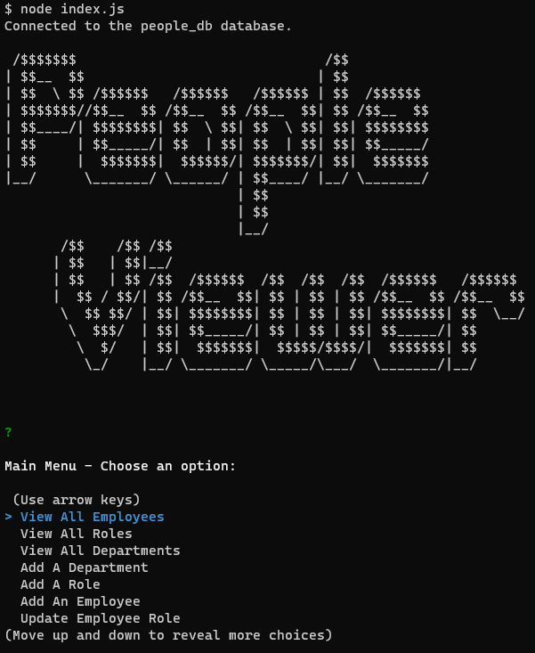

# People Viewer

## Description

Repo URL: https://github.com/alexilson/People-Viewer

Video Demo: https://drive.google.com/file/d/1yv11G-zVypYnaZRSDFmUhxlMXMk2cale/view

Harness the power of Node.js and command-line interface to effortlessly manage your employees, departments, and roles with People Viewer. This robust application empowers business owners to efficiently organize and optimize their workforce. From tracking employee information to managing departments and roles, People Viewer streamlines your operations, giving you the control and insights you need to thrive. Say goodbye to manual processes and hello to a seamless employee management experience. Let People Viewer revolutionize the way you manage your team!

## Table of Contents
[Installation](#installation)

[Usage](#usage)

[License](#license)

[Contributing](#contributing)

[Questions](#questions)

## Installation
Must have Node.JS installed.
Clone the repository to your local machine and navigate to the People-Viewer folder.
Run "npm i" to install dependencies.
Then, run "db/schema.sql" to initialize the database.
If desired, run "db/seeds.sql" to populate the database with example data.
Next, edit "helpers/queries.js" and the credentials for your database server.
Finally, run "node index.js" to run the program.

## Usage
Select an option from the menu and answer the prompts as directed.

## License
MIT License

## Contributing
This project cannot be contributed to at this time.

## Questions
For additional questions, please contact me here:

GitHub: https://www.github.com/alexilson

Email: mailto:ilson.alex@gmail.com
